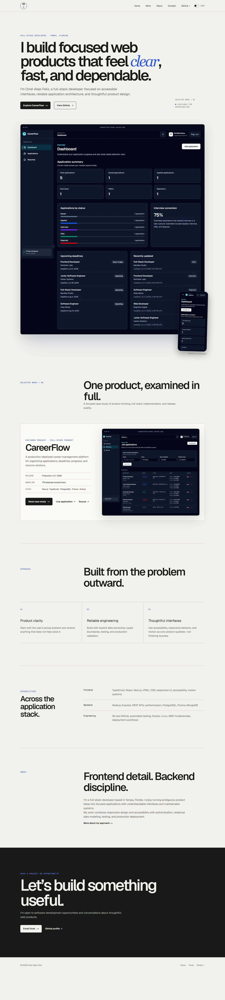

# Oniel Alejo Feliz — Developer Portfolio

A minimalist, typography-led portfolio for full-stack developer [Oniel Alejo Feliz](https://github.com/XonkelX). The first release centers on CareerFlow as an in-depth product and engineering case study.

[Live portfolio](https://oniel-portfolio.vercel.app) · [CareerFlow](https://careerflow-snowy.vercel.app) · [CareerFlow source](https://github.com/XonkelX/ai-career-tracker) · [v1.0 release](https://github.com/XonkelX/ai-career-tracker/releases/tag/v1.0.0) · [complete demo](https://github.com/XonkelX/ai-career-tracker/releases/download/v1.0.0/careerflow-v1-demo.mp4)

## Overview

The portfolio presents Oniel as a product-minded full-stack developer who combines dependable engineering with accessible interface design. It is intentionally small: three static routes, one featured project, no content management system, and no backend.

## Featured project

CareerFlow is a production-deployed career-management application for organizing opportunities, application stages, deadlines, dashboard insight, and targeted resume versions. Its case study explains the product workflow, real architecture, important engineering decisions, release validation, accessibility work, and zero-cost deployment constraints.



## Technology stack

- Next.js 16 App Router and React 19
- Strict TypeScript
- Tailwind CSS 4 with a small semantic token layer
- Motion for React for focused interaction transitions
- Next.js Image and generated metadata images
- Vitest and Testing Library
- Playwright and axe-core
- ESLint and Prettier

All routes are statically rendered. Client code is limited to theme selection, mobile navigation, and subtle product-media motion.

## Design direction

The visual system uses warm off-white and charcoal surfaces, a single restrained blue accent, locally bundled Geist and Geist Mono fonts, precise rules, deliberate asymmetry, and generous negative space. Product imagery follows an editorial rhythm instead of a repeated card grid.

Semantic CSS variables power both themes. The first visit follows the operating-system preference; an explicit light or dark selection is stored locally and resolved before paint to avoid an obvious flash.

## Motion and accessibility

Motion supports entrance hierarchy, menu state, project-media depth, hover feedback, and section reveals. Critical content is present in the initial HTML. Under `prefers-reduced-motion`, delays, movement, smooth scrolling, and nonessential transitions collapse to effectively instant feedback.

Accessibility work includes semantic landmarks, one clear page heading, a skip link, visible focus, keyboard navigation, an Escape-dismissible focus-managed mobile dialog, safe external-link names, descriptive image alternatives, video controls and an adjacent text equivalent, sufficient tap targets, responsive reflow, and automated axe checks.

## Local development

Requirements: Node.js 22.x and npm 11.x or newer.

```bash
npm ci
npm run dev
```

Open `http://localhost:3000`.

## Commands

```bash
npm run dev           # local development
npm run build         # optimized production build
npm run start         # serve the production build
npm run format        # write formatting
npm run format:check  # verify formatting
npm run lint          # ESLint with zero warnings
npm run typecheck     # strict TypeScript check
npm run test          # unit and component tests
npm run test:watch    # interactive Vitest mode
npm run test:e2e      # Playwright browser suite
```

Install the Playwright Chromium browser once before the browser suite:

```bash
npx playwright install chromium
```

## Project structure

```text
src/
├── app/                     # Routes, metadata, sitemap, robots, generated images
├── components/              # Focused layout and interaction components
├── content/                 # Typed site and project configuration
└── types/                   # Project content contracts
public/projects/careerflow/  # Public screenshots, poster, and 10-second preview
tests/
├── e2e/                     # Browser and accessibility smoke coverage
└── *.test.*                 # Content, component, and motion checks
docs/assets/screenshots/     # Finished portfolio presentation captures
```

## Deployment and cost model

The site is designed for Vercel Hobby with no environment variables, database, storage, forms, paid fonts, or paid platform features. The canonical URL is held in the typed site configuration and used by page metadata, the sitemap, and robots output.

The portfolio costs $0 to operate within Vercel Hobby quotas. CareerFlow is a separate application and repository; this portfolio only includes its intentionally public presentation assets.

## Privacy

The portfolio has no backend and no database. It collects no visitor information, sends no contact submissions, uses no analytics or tracking, and creates no cookies. The only browser storage is the visitor’s local theme preference. Contact uses a normal `mailto:` link.

## Adding future projects

Add a typed entry in `src/content/projects.ts`, copy only intentional public media into a project-specific folder under `public/projects`, then create a dedicated case-study route when the project has enough verified material. The homepage component can consume the shared metadata without a CMS.

## Author

Built by [Oniel Alejo Feliz](mailto:Onielbf10@gmail.com), a full-stack developer based in Tampa, Florida.
